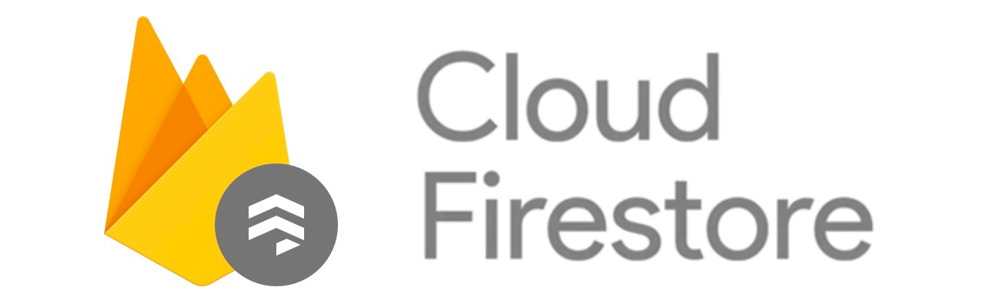

# Open Street Map

OpenStreetMap provides map data for thousands of websites, mobile applications, and hardware devices

### Why we used it?

We use it to be able to map the map of the university easily, in addition to being a free api, we can use data such as coordinates to be able to mark the buildings, to be able to create events with locations that are shown on the map using their coordinates

More information here
[OpenStreetMap](https://www.openstreetmap.org/#map=5/23.944/-102.579)

# Leaflet

Leaflet is the leading open-source JavaScript library for friendly interactive maps. Weighing just about 39 KB of JS, it has all the mapping features most developers ever need.

Leaflet is designed with simplicity, performance and usability in mind. It works efficiently across all major desktop and mobile platforms, can be extended with lots of plugins, has a beautiful, easy to use and well-documented API and a simple, readable source code that is a joy to contribute to.

More information here [Leaflet](https://leafletjs.com/)

# Firebase
Firebase is a platform for the development of web applications and mobile applications developed by Google in 2014.1

It is a platform located in the cloud, integrated with Google Cloud Platform, which uses a set of tools for the creation and synchronization of projects that will be endowed with high quality, making possible the growth of the number of users and also giving results to the obtaining of greater monetization.

## Firestore

Cloud Firestore is a flexible and scalable database for server, mobile, and web development from Firebase and Google Cloud. Like Firebase Realtime Database, it keeps your data in sync between client apps through listeners in real time and offers offline support for mobile devices and the web, so you can build responsive apps that work no matter what the network latency or internet connectivity. Cloud Firestore also offers seamless integration with other Firebase and Google Cloud products, including Cloud Functions.

### Why we used it?

Like Realtime Database, Cloud Firestore uses data synchronization to update data from any connected device. However, it is also designed to run single and simple recovery queries efficiently.

More information here [Cloud Firestore](https://firebase.google.com/docs/firestore?hl=es)

# Bootstrap

Bootstrap is a cross-platform library or open source toolkit for website design and web applications. It contains design templates with typography, forms, buttons, boxes, navigation menus, and other HTML and CSS-based design elements, as well as additional JavaScript extensions. Unlike many web frameworks, it only deals with front-end development.

More information here [Bootstrap](https://getbootstrap.com/)

|[:arrow_left: 6. Coding Standar](Coding_Standard.md)|[8. Prototype :arrow_right:](https://www.figma.com/proto/53Esj8R5f7GGK57IqEFovv/Proyecto-POO?node-id=32%3A50&scaling=scale-down-width)|
|---|---|
