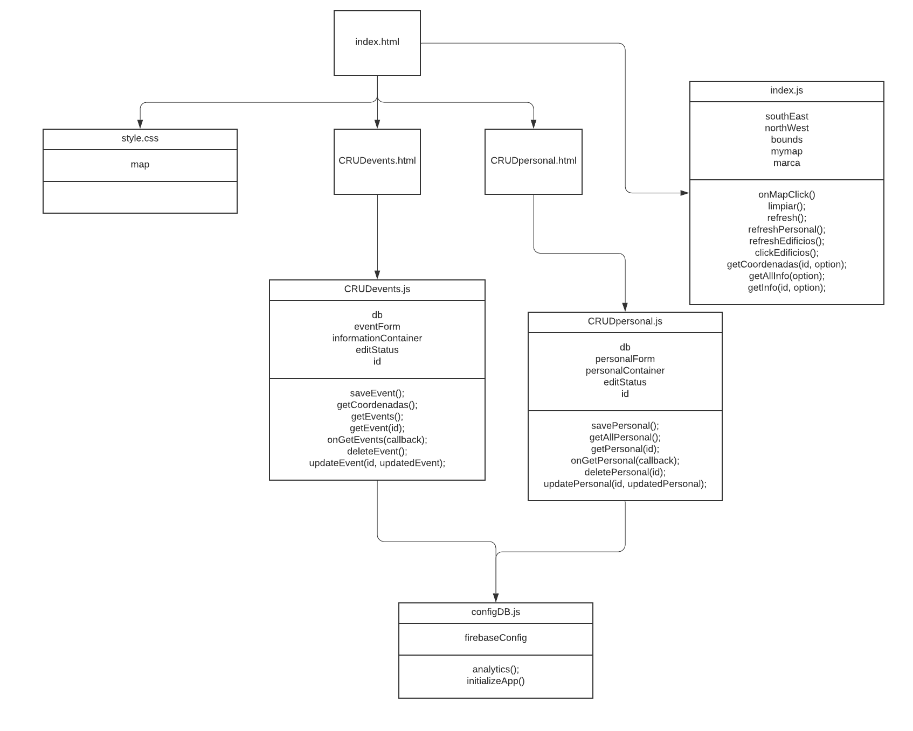
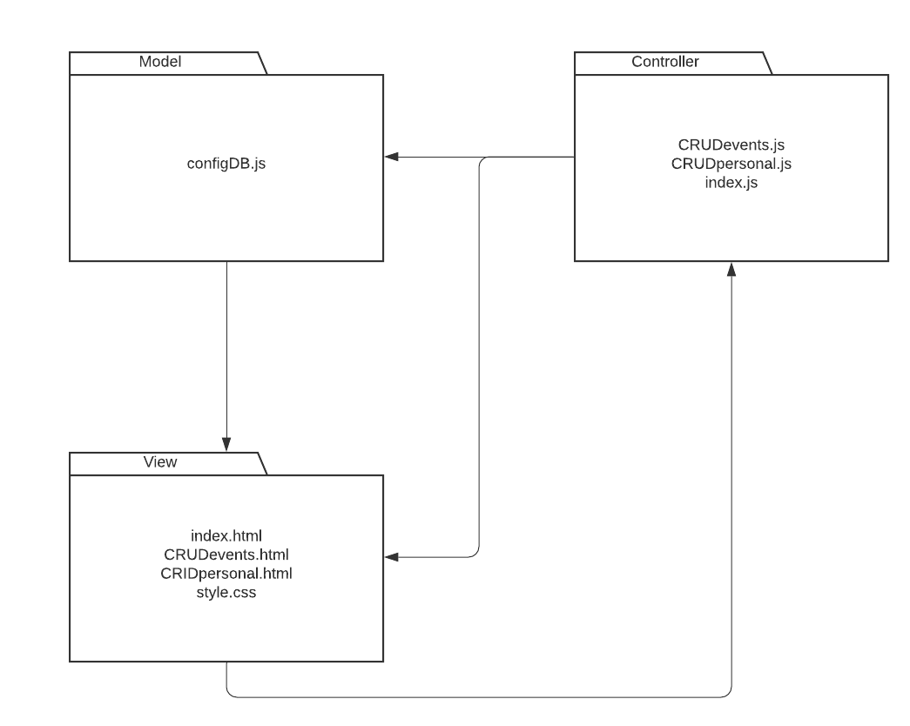

# Requirements Mapping

The application allows the user to view information about the faculty staff. This information can be added, modified and deleted only by administrators. Users can view the faculty sketch, however it will not be possible to modify it.

#### [Prototipe](https://www.figma.com/proto/53Esj8R5f7GGK57IqEFovv/Proyecto-POO?node-id=32%3A50&scaling=scale-down-width) for more information

# Classes Diagram

# Package Diagram

# MVC Evidence

+ Model
    + configDB.js

+ View
    + index.html
    + CRUDevents.html
    + CRUDpersonal.html
    + syle.css

+ Controler
    + CRUDevents.js
    + CRUDpersonal.js
    + index.js
