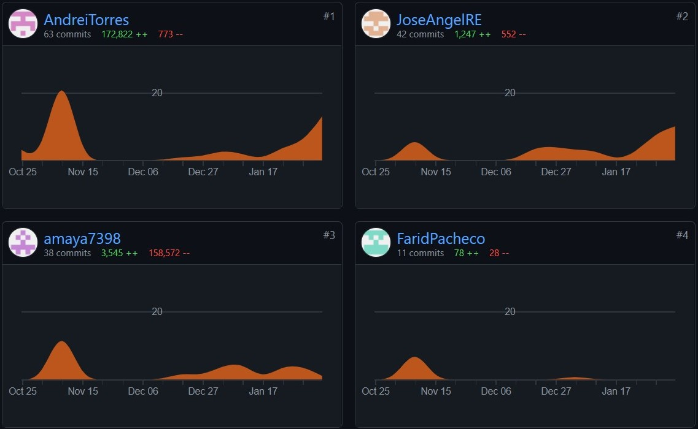

# Project URL

[Code Project](https://github.com/AndreiTorres/G2_POO/tree/main/App)

# Repository use

|[ :arrow_left: 3. Design](Design.md)|[ 5. Development Process :arrow_right:]("Development Process.md")|
|---|---|