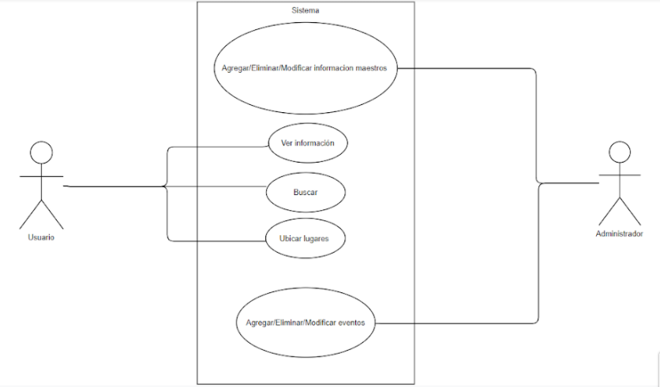

# Functional Requirements:

The application allows the user to view information about the faculty staff. This information can be added, modified and deleted only by administrators. Users can view the faculty sketch, however it will not be possible to modify it.

## Requirements list: 

*   View a list with information about each teacher, in which you can find different information about them, such as email, name and cubicle with their exact location that will be reflected on the main map with a mark.

*   View on the main screen of the application a list with the different events and activities that are being carried out or about to be carried out, in which you will find a small description of said events, hours and their location will be reflected on the main map through of a mark when these pins are pressed.

*   Visualization of the sketch of the mathematics faculty, the points of interest will be shown, such as the classrooms, bathrooms, cafeteria, among others, and each area of ​​the faculty will be detailed.

*   Enter the information you want to find in a search bar. It can be done by several fields, such as the name of the teacher, place, building, zones, it will have field autocompletion.

*   Administrators can, through a database, add, delete or modify information about personnel and events or activities carried out in the faculty.

## Non functional requirements:

*    The page will have a database with the different information of the administrative staff.
*    It can only be accessed through an internet connection, so anyone with an available network can enter.
*    The information inside will be modified by an administrator, while all those who are not will only be able to see the different sections.
*    Locations and events can only be viewed if they have previously been properly added with the required data such as time and location. 

## Changes
+ Show in the map the exact location of the teacher's cubicle was removed.
+ The search bar was removed.

# USE CASES

### Case-01: *Search Cubicle*
### Description: *The user will be able to search the teachers' cubicles through options displayed by a hamburger menu*

### Steps: 
   1. The user accesses the menu through the hamburger button
   2. The user selects "Cubicles" among various options.
   3. The user sees a list of cubicles displayed, below a map fixed in the middle of the screen.
   4. User selects desired cubicle.
   5. The user sees the cubicle information displayed and can click the "locate" button to display a pin of the location of the cubicle on the map.

- - -

### Case-02: *Search Building*
### Description: *The user will be able to search the buildings and the information of each one through options displayed by a hamburger menu*

### Steps: 
   1. The user accesses the menu through the hamburger button
   2. The user selects "Buildings" among various options.
   3. The user sees a list of buildings displayed below a map fixed in the middle of the screen.
   4. The user selects the desired building.
   5. The user sees the building information and a pin showing the location of the building displayed.

- - -

### Case-03: *Search Teacher*
### Description: *The user will be able to find the contact information of the teachers through options displayed by a hamburger menu*

### Steps: 
   1.  The user accesses the menu through the hamburger button
   2.  The user selects "Teachers" among various options.
   3.  The user sees a list of Teachers displayed, below a map fixed in the middle of the screen.
   4.  The user selects the desired Teacher.
   5.  The user sees the teacher's contact information displayed and can click on the button "locate him" to display a pin of his location on the map and can also send him an email from the contact card.

- - -

### Case-04: *Search for events*
### Description: *The user will be able to search the events that are programmed in the School.*

### Steps.
   1.  The user opens the application.
   2.  The user enters the menu through the hamburger button.
   3.  The user selects the "events" option.
   4.  The user selects the event.

- - -

### Case-05: *Search by bar*
### Description: *The user will be able to make use of a search bar, with which he will be able to identify the buildings, cubicles or teachers, with the name of the character to be searched.*

### Steps:
   1.  The user to the search bar, clicking on a magnifying glass in the upper right area.
   2.  The user sees the search bar and a keyboard displayed and centered, through which he will enter the name (Buildings, cubicles, Teacher) to find.
   3.  The user selects the complete option
   4.  The user is directed to the corresponding section according to their choice.

### Alternate Flow:
* It will display an option with the message "X not found", X being the user's search.
* If there were 2 people working within the same cubicle, both options would be seen in the search bar.

- - -

### Case-01- ADMIN: *Modify information about events, teachers, cubicles, buildings*
### Description: The administrator may modify personal information, events, and information regarding FMAT.

Steps:
  1. The administrator can access any section as a normal user.
  2. The administrator will be able to press the configuration buttons that will be in all the option lists, (section where all the events, teachers, cubicles, or buildings are shown).
  3. A space will be displayed where you can select the information to be modified (you can choose multiple options).
  4. The fields of the chosen options will be displayed, the administrator will change this information and will click on the save option.
  5. The system will ask for confirmation of the process through the administrator's credentials.
  6. The administrator will write their credentials and press accept.

	
### Alternate Flow: 
* If the administrator leaves any field empty, the request will bounce and will display a notification with the message "Changes not made" (or similar).
* The administrator may cancel the verification of the credentials, therefore the process would be canceled.
* If the credentials are incorrect, the process will bounce with a notification "Incorrect password, try again".

- - -

### Case-02-ADMIN: *Delete information about events, teachers, cubicles, buildings*
### Description: The administrator may delete personal information, events, and information regarding FMAT.

Steps:
  1. The administrator can access any section as a normal user.
  2. The administrator will be able to press the configuration buttons that will be in all the option lists, (section where all the events, teachers, cubicles, or buildings are shown).
  3. The list of options to delete will be displayed, the administrator will select the information to delete.
  4. The administrator will press the "delete" button.
  5. The system will ask for confirmation of the process through the administrator's credentials.
### Alternate flow: 
* The administrator may cancel the verification of the credentials, therefore the process would be canceled.
* If the credentials are incorrect, the process will bounce with a notification "Incorrect password, try again".

- - -

### Case-03-ADMIN: *Management add event, teacher, cubicle, building*
### Description: *The administrator can add from events, teachers, cubicles and buildings*

### Steps:
   1.  A "save" button symbol will appear on the initial screen, when pressed, a section will be displayed with all the fields to be filled.
   2.  We choose the type of section to add, the fields will change
   3.  Add the fields, and we give it to save
### Alternate flow:
* The administrator will not be able to leave any box empty when creating the event, otherwise the event will not be created.
* The administrator may cancel the creation process, therefore the process would be canceled.

- - -

# User Stories:

* As a user I can see a hamburger button (top left) and the centered FMAT map

* As a user I can see a navbar in the upper left area that displays options (Buildings, Rooms, Cubicles, Teachers, Points, Events, among others) to navigate.

    * As a user I can display the contact information of the teachers, from the navigation navbar, with the map fixed in the middle of the screen
    
        * As a user I can scroll between the various teachers.
        * As a user I can send you email from the information displayed
        * As a user, I can display a small sketch that will show me the cubicle of the selected teacher with greater precision.

    * As a user I can request the location of a certain specific point (bathrooms, drinking fountains, etc.), a building, living room or cubicle
    
        * As a user, I can display more information about the building, such as its map.

    * As a user I can see upcoming events to be held, with their respective information: time, day, space / availability, place: building, room

    * As a user I can see the cubicles and buildings with their respective information

* As a user, I can see on the map small pins that show me the various buildings, rooms, cubicles and events (before selecting the type, with the exception of events, these will always be shown with pins)

    * As a user I can see extra detailed information of each event (If it had it) by pressing on the pin or "more information"

* As a user I can use the desktop version

* As a user I can see the navbar fixed to the right in desktop mode

### Uses case diagram

