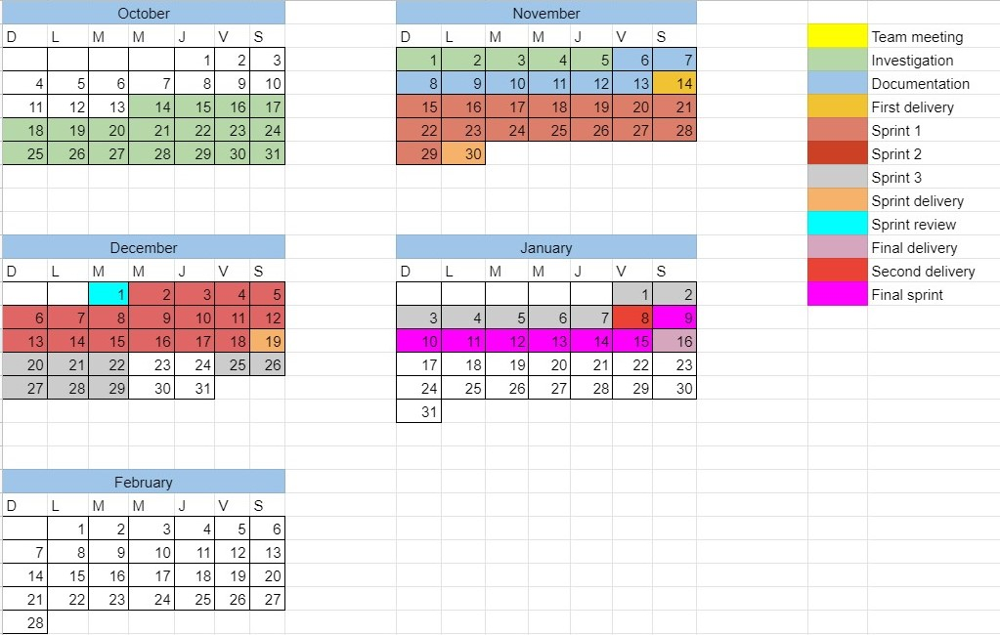

# Development process

## Methodology

The methodology of the team was to meet 4 days a week at 6:00 pm for 1 hour to discuss the individual tasks of each person.

### Team Roles

+ Daniel Salvador Amaya Tapia: Developer/ Testing
+ Jesus Andrei Torres Landero: Developer/ Testing
+ José Ángel Ruiz Escalante: Developer/ Project Manager
+ Farid Pacheco: Developer 

#### Tools

+ Trello
+ Git
+ GitHub
+ WhatsApp
+ Discord

## Monitoring Process

Our monitoring process is to make a todoList and mark the things done and those that remain to be done.

In addition, each progress of each member is notified to the team's WhatsApp group to schedule a meeting with the team in discord depending on availability.
[Link to Trello](https://trello.com/b/zuJK3nxW/proyecto-poo)

### Metric
The qualification of each member will be awarded according to the following metric.

| Evaluation aspect  | Points  | 
| ----------------- | ------- | 
| Tasks             |    2    |   
| Meetings          |    2    | 
| Code              |    2    | 
| Investigation     |    2    | 
| Ideas             |    1    | 
| Commits           |    1    | 
| Total             |    10   | 

### Individual Contribution

##### Jesús Andrei Torres Landero

| Evaluation aspec  | Points  | 
| ----------------- | ------- | 
| Tasks             |    2    |   
| Meetings          |    2    | 
| Code              |    2    | 
| Investigation     |    2    | 
| Ideas             |    1    | 
| Commits           |    1    | 
| Total             |    10   |

##### José Ángel Ruiz Escalante

| Evaluation aspec  | Points  | 
| ----------------- | ------- | 
| Tasks             |    2    |   
| Meetings          |    2    | 
| Code              |    2    | 
| Investigation     |    2    | 
| Ideas             |    1    | 
| Commits           |    1    | 
| Total             |    10   |

##### Daniel Salvador Amaya Tapia

| Evaluation aspec  | Points  | 
| ----------------- | ------- | 
| Tasks             |    2    |   
| Meetings          |    2    | 
| Code              |    2    | 
| Investigation     |    2    | 
| Ideas             |    1    | 
| Commits           |    1    | 
| Total             |    10   |

##### Farid Antonio Pacheco Pérez

| Evaluation aspec  | Points  | 
| ----------------- | ------- | 
| Tasks             |    0    |   
| Meetings          |    1    | 
| Code              |    0    | 
| Investigation     |    1    | 
| Ideas             |    1    | 
| Commits           |    0    | 
| Total             |    3    |

### Individual reports

---

+ Jesús Andrei Torres Landero:
***First report***: Although I like the project, I think we may have problems with not having experience with javascript, I think we need more organization, for now we are investigating about the apis that we can use

***Second report***: 
After discussing many ideas we have decided which tools to use, I began to investigate which database we can use while the tests will be done locally

***Final report***: 

---

+ Jose Angel Ruiz Escalante:
***First report***: We plan to make an interactive map in which the events, faculty buildings can be seen and thus achieve a better organization of them to help students and external people.

***Second report***: Research on the use of the Bootstrap framework and the Lefleat OpenStreetMap API.

***Final report***: Changes were made from the start. The page managed to have the expected main functions.

---

+ Daniel Salvador Amaya Tapia:
***First report***:
First of all we were planning about create an extension for VSCode or for the use of CMD.
After that we decide to create and interactive app where you can find the events that will happen and also it could help you guiding you about the cubiculos and buildings

***Second report***:
We were searching for the best tools we can use. We were searching for the DB tool and tried the use of DIXIE also we decide to implement the use of bootstrap

***Final report***
We finally change the DB from dexie to Cloud Firestore. The app was finished and all the detail were tug

## Schedule

|[:arrow_left: 4. Implementation](Implementation.md)|[6. Coding Standar :arrow_right:](Coding_Standard.md)|
|---|---|
