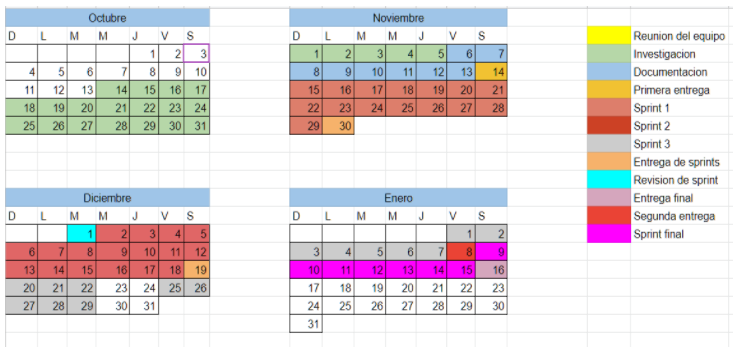

# Team roles

* Daniel Salvador Amaya Tapia: Equipo de programación/ Testing
* Jesus Andrei Torres Landero: Equipo de programación/ Testing
* José Ángel Ruiz Escalante: Equipo de programación/ Project Manager
* Farid Pacheco: Equipo de programación

# Tools

Trello: 
This ToDo List mechanism organizes the backlog, being able to see the magnitude of the project. In the same way, we can select a specific card and focus on working with it; With Trello we can assign tasks to specific people and we can see the progress of this in real time, being able to notify someone's lag, as well as measure the participation and performance of each member.

https://trello.com/ 

OpenStreetMap:  
It is a collaborative project to create editable and free maps. Instead of the map itself, the data generated by the project is considered its main output.
Registered users can upload their tracks from the GPS and create and correct vector data using editing tools created by the OpenStreetMap community. Every week 90,000 km of new roads are added with a total of almost 24,000,000 km of roads (February 2011), not counting other types of data (tracks, roads, points of interest, etc.).

https://www.openstreetmap.org/#map=19/21.04819/-89.64427

# Calendar

https://docs.google.com/spreadsheets/d/1JCRgN7IMtjGCi-xUv9jH37zGM__SNaFIltJlsuRAYro/edit#gid=0 

|[<-- 4. Casos de uso](Casos_de_Uso.md)|[6. Diagrama de clases y paquetes -->](diagramaClases_paquete.md)|
|---|---|

