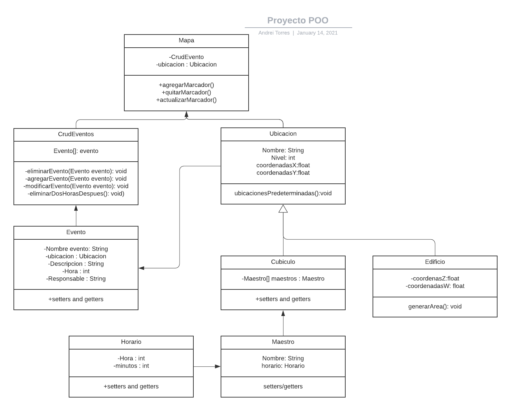
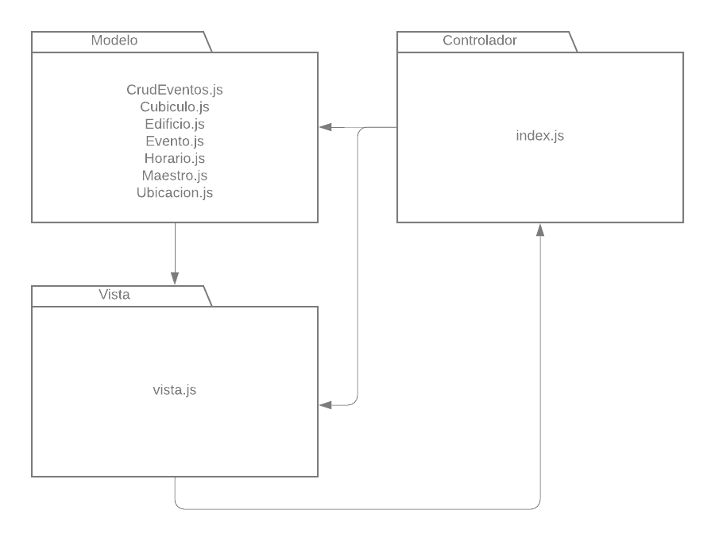

# Diagrama de clases

# Diagrama de paquetes

|[<-- 5. Herramientas y roles de equipo](Roles_de_Equipo.md)|[7. Prototipo -->](https://www.figma.com/proto/53Esj8R5f7GGK57IqEFovv/Proyecto-POO?node-id=32%3A50&scaling=scale-down-width)|
|---|---|